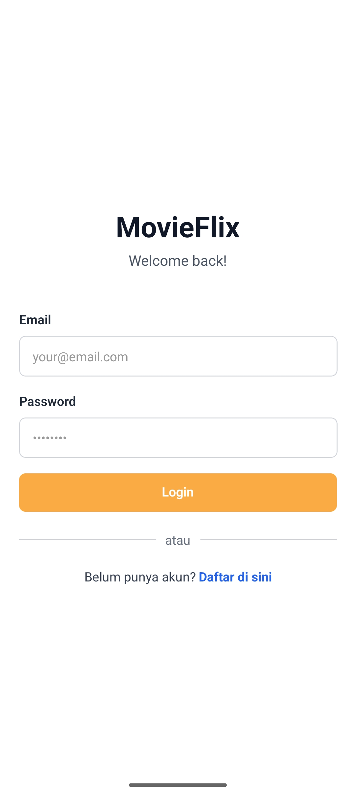
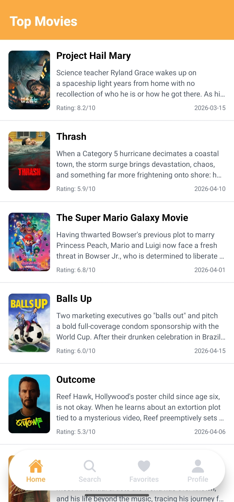
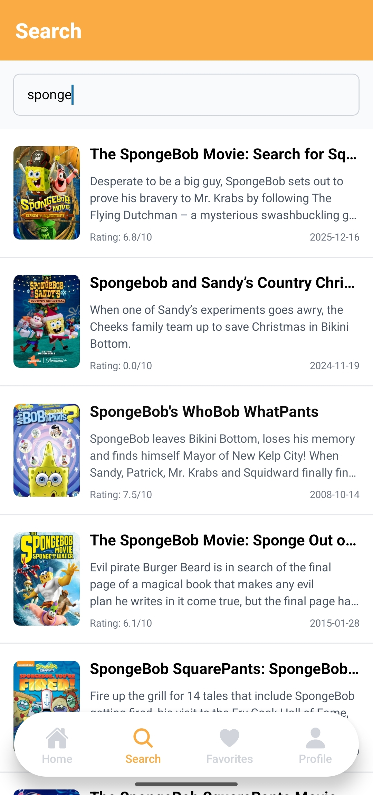
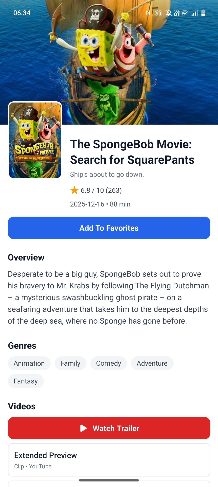

# React Native Learn - Movie App

<p align="left">
   
   
   
   
</p>

Learning project for building a modern movie app using React Native + Expo Router.

This repository is my playground to learn core React Native concepts in a real project: routing, state management, API integration, list performance, reusable components, and clean project architecture.

## Preview

- Auth flow (Login/Register)
- Bottom tab navigation
- Home screen with infinite scroll
- Search movies
- Favorites list
- Movie detail screen + trailer launch

## App Screenshots and GIF Preview

Section ini sudah disiapkan untuk preview GitHub. Tinggal tambahkan file screenshot/GIF kamu, lalu replace nama file di bawah.

Suggested folder:

```text
docs/media/
   login.png
   home.png
   search.png
   detail.png
   app-flow.gif
```

Template yang bisa langsung dipakai:

```md
## App Screenshots and GIF Preview

<p align="center">
   
</p>

| Login                            | Home                           |
| -------------------------------- | ------------------------------ |
|  |  |

| Search                             | Detail                             |
| ---------------------------------- | ---------------------------------- |
|  |  |
```

Contoh placeholder saat ini:

<p align="center">
   
</p>

## Tech Stack

- React Native + Expo
- Expo Router (file-based routing)
- TypeScript
- Zustand (state management)
- NativeWind (utility-first styling)
- TMDB Public API
- AsyncStorage (persist favorites)

## Project Goals

- Learn React Native fundamentals in production-like structure
- Practice clean architecture separation: API client, endpoints, services, store, UI
- Understand list rendering performance (`FlatList`, pagination, infinite scroll)
- Build reusable validation + auth flows

## Folder Structure

```text
app/
   _layout.tsx
   auth/
   (tabs)/
   movie/

api/
   client.ts
   endpoints.ts
   tmdb.ts
   user.ts

store/
   authStore.ts
   movieStore.ts

types/
   auth.ts
   movie.ts

utils/
   validators/

components/
docs/
```

## Getting Started

### 1. Install dependencies

```bash
npm install
```

### 2. Setup environment variables

Create `.env` (or copy from `.env.example`) and fill with your TMDB key:

```env
EXPO_PUBLIC_TMDB_API_KEY=your_tmdb_api_key
EXPO_PUBLIC_TMDB_BASE_URL=https://api.themoviedb.org/3
EXPO_PUBLIC_TMDB_IMAGE_URL=https://image.tmdb.org/t/p/w500
```

### 3. Run app

```bash
npx expo start -c
```

Useful scripts:

```bash
npm run android
npm run ios
npm run web
npm run lint
```

## Learning Notes

- `ScrollView` for small static content
- `FlatList` for data list (virtualized, better performance)
- `VirtualizedList` is low-level base list behind `FlatList`

Extra notes available in:

- `docs/react-native-components-guide.md`
- `docs/LEARNING_GUIDE.md`

## Current Features

- [x] Authentication UI + local auth logic
- [x] Home movie list from TMDB
- [x] Infinite scroll pagination (trending movies)
- [x] Search movies
- [x] Movie detail screen
- [x] Trailer link open in browser
- [x] Favorites state + persistence

## Next Improvement Ideas

- [ ] Skeleton loading for lists and detail page
- [ ] Better error boundary and retry UI
- [ ] Unit tests for store and validators
- [ ] Pull-to-refresh for more screens
- [ ] Better accessibility labels

## Credits

- API: [The Movie Database (TMDB)](https://www.themoviedb.org/)
- Framework: [Expo](https://expo.dev/)

---

If you have suggestions, feel free to open an issue or PR.
